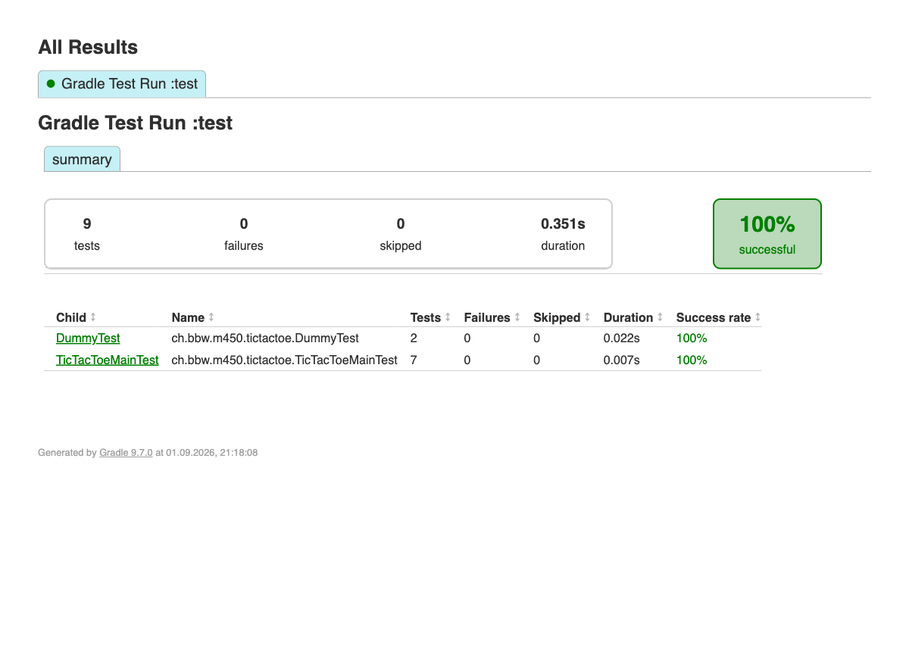
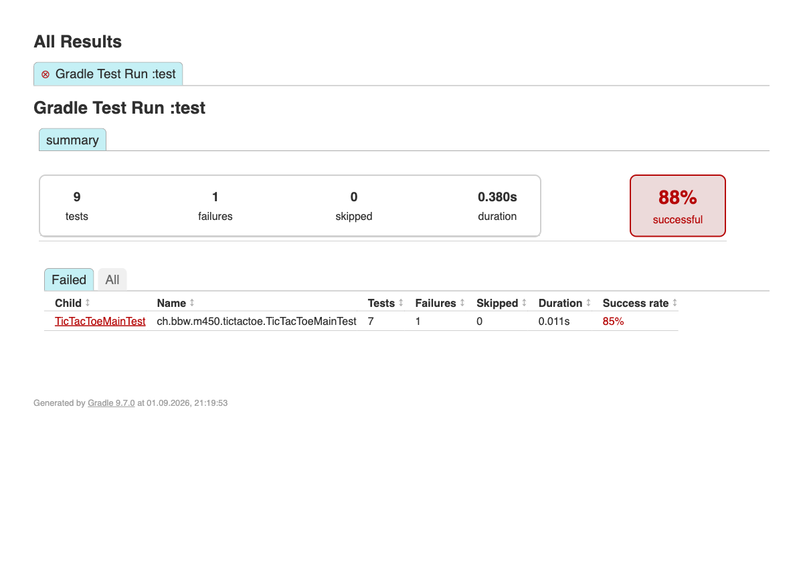

# Test-Dokumentation – TicTacToe

## 1. Setup (JUnit 5 + AssertJ)

Das Projekt ist ein Gradle-Projekt (`build.gradle`) mit folgenden Test-Abhängigkeiten:

```groovy
dependencies {
    testImplementation platform('org.junit:junit-bom:5.11.4')
    testImplementation 'org.junit.jupiter:junit-jupiter'
    testImplementation 'org.assertj:assertj-core:3.27.7'
    testRuntimeOnly 'org.junit.platform:junit-platform-launcher'
}

test {
    useJUnitPlatform()
}
```

Tests ausführen: `./gradlew test`
Report danach unter: `build/reports/tests/test/index.html`

## 2. Dummy-Tests

Datei: [`DummyTest.java`](../src/test/java/ch/bbw/m450/tictactoe/DummyTest.java)
Zweck: rein technischer Nachweis, dass JUnit 5 und AssertJ korrekt eingebunden sind (keine TicTacToe-Logik).

| Test | Given | When | Then |
|---|---|---|---|
| `dummyJUnitTest` | zwei Ganzzahlen 1 und 1 | die Summe gebildet wird | ist das Ergebnis 2 (geprüft mit JUnit `assertTrue`) |
| `dummyAssertJTest` | zwei Ganzzahlen 1 und 1 | die Summe gebildet wird | ist das Ergebnis 2 (geprüft mit AssertJ `assertThat(...).isEqualTo(...)`) |

## 3. TicTacToe-Tests (Given-When-Then)

Datei: [`TicTacToeMainTest.java`](../src/test/java/ch/bbw/m450/tictactoe/TicTacToeMainTest.java)
Es sind 7 Tests vorhanden (mehr als die geforderten 5), alle über AssertJ (`WithAssertions`).

| # | Test | Given | When | Then |
|---|---|---|---|---|
| 1 | `isWinningDiagonalForX` | ein Brett mit der Diagonalen 0-4-8 aus X belegt (`XOO OX. XOX`) | auf einen Sieg von X (`Stone.CROSS`) geprüft wird | wird `true` zurückgegeben |
| 2 | `isWinningTopRowForO` | ein Brett mit der obersten Reihe (0-1-2) aus O belegt (`OOO XX. .X.`) | auf einen Sieg von O (`Stone.CIRCLE`) geprüft wird | wird `true` zurückgegeben |
| 3 | `emptyBoardIsNoWin` | ein komplett leeres Brett (`... ... ...`) | auf einen Sieg von X geprüft wird | wird `false` zurückgegeben |
| 4 | `aRowOnlyWinsForItsOwnColor` | ein Brett, auf dem nur O die oberste Reihe komplett hat (`OOO XX. .X.`) | auf einen Sieg von X geprüft wird | wird `false` zurückgegeben (eine Reihe gewinnt nur für die eigene Farbe) |
| 5 | `givenADiagonal_whenCheckingX_thenItWins` | ein Brett mit der Diagonalen aus X belegt (`XOO OX. XOX`) | auf einen Sieg von X geprüft wird | wird `true` zurückgegeben (identisch zu Test 1, hier explizit im Given-When-Then-Stil geschrieben) |
| 6 | `twoGreedyPlayersLetTheStartingPlayerWin` | zwei `GreedyPlayer`-Instanzen, die beide immer das oberste freie Feld wählen | eine komplette Partie gespielt wird (`TicTacToeMain.play`) | gewinnt der startende Spieler X über die Diagonale 0-4-8 |
| 7 | `theSamePlayerInstanceTwiceIsRejected` | dieselbe `GreedyPlayer`-Instanz als X- und O-Spieler übergeben | eine Partie gestartet wird | wird eine `IllegalArgumentException` geworfen |

## 4. Test-Code auf GitHub

Repository: `SunriseDuarte/450-tictactest-mvk`

- [`TicTacToeMainTest.java`](https://github.com/SunriseDuarte/450-tictactest-mvk/blob/main/src/test/java/ch/bbw/m450/tictactoe/TicTacToeMainTest.java)
- [`DummyTest.java`](https://github.com/SunriseDuarte/450-tictactest-mvk/blob/main/src/test/java/ch/bbw/m450/tictactoe/DummyTest.java)

## 5. Screenshot – alle Tests erfolgreich

Ausgeführt mit `./gradlew test`, Report über den Browser geöffnet und als Screenshot gesichert.



## 6. Screenshot – ein fehlschlagender Test

Für den Nachweis wurde `emptyBoardIsNoWin()` kurzzeitig manipuliert (`isFalse()` → `isTrue()`), sodass die Assertion fehlschlägt. Danach wurde die Änderung wieder rückgängig gemacht, damit die Test-Suite wieder grün ist.

Übersicht (1 von 9 Tests fehlgeschlagen, 88%):



Detailansicht der Klasse mit dem fehlgeschlagenen Test:


Stacktrace des fehlgeschlagenen Tests:


